# Development Plan for Meta Ads Agency Platform Transformation

## Executive Summary

Transform the existing Meta Ads Analytics Platform into a **professional, enterprise-grade multi-tenant agency dashboard** that enables digital marketing agencies to manage multiple clients, invite employees with role-based access, and provide comprehensive Meta API insights. The platform will serve as a white-label solution for agencies managing £2M+ in ad spend across multiple client accounts.

## Current Platform Status (January 2025)

### ✅ What's Already Built and Live
- **Production URL**: https://frontend-ten-eta-42.vercel.app
- **Authentication**: Email/password + Facebook OAuth working
- **Dashboard**: Real-time analytics with interactive charts
- **Campaign Management**: Direct Meta API integration (200+ accounts supported)
- **Testing Infrastructure**: 49 tests passing (Phase 4 complete)
- **Professional UI**: Dark theme, responsive design, British localisation (£)

### 📊 Completed Development Phases
1. **Phase 1**: Core Authentication & Database Setup ✅
2. **Phase 2**: Direct Meta API Architecture ✅
3. **Phase 3**: Professional Agency Navigation ✅
4. **Phase 4**: Enterprise Testing Infrastructure ✅ (49 tests passing)

### 🎯 Platform Transformation Goals
Transform from current single-user analytics platform to:
- **Multi-tenant agency system** with complete data isolation
- **Employee management** with granular role-based permissions (Owner/Manager/Viewer)
- **White-label capabilities** for agency branding
- **Enterprise security** with audit logging and compliance
- **Scale**: 100+ concurrent users with 200+ ad accounts per agency

## Technical Architecture

**Current Stack:**
- **Frontend**: Next.js 14, TypeScript, Tailwind CSS, Shadcn/ui, Recharts
- **Backend**: Supabase (PostgreSQL, Edge Functions, Auth)
- **External APIs**: Meta Marketing API v19.0
- **Deployment**: Vercel (frontend), Supabase Cloud (backend)
- **Testing**: Jest + React Testing Library (49 tests passing)

**Key Architectural Decision**: Direct API pattern - all campaign data fetched real-time from Meta API, no database caching.

## 📍 Current Development Status

### ✅ Completed Phases (Production Ready)
1. **Phase 1-4 of Initial Platform Development**: COMPLETE
   - Core authentication and database setup
   - Direct Meta API architecture implementation  
   - Professional agency navigation integration
   - Enterprise testing infrastructure (49 tests passing)

### 🎯 Current Focus: Phase VI - Screenshot Review & UI Enhancement
**Status**: Ready to review screenshots and enhance UI with real data
**Goal**: Ensure UI matches vision and displays real Meta API data correctly

### 🚀 Immediate Priority: UI Work with Real Data
Before any multi-tenant transformation, we're focusing on:
- Screenshot-driven UI validation and enhancement
- Real data integration from Meta API
- Professional agency-grade interface refinement
- Performance optimization for large datasets

### 📋 Future Transformation Phases
After UI perfection, we'll transform the platform to support:
- Multi-tenant agency architecture
- Employee role-based access control
- White-label capabilities
- Enterprise security and compliance

## Phase Dependencies

```mermaid
graph TD
    P0[Phase 0: Foundation ✅] --> PV[Phase V: Platform Validation ✅]
    PV --> P6[Phase VI: Screenshot Review & UI]
    P6 --> P7[Phase VII: Real Data Enhancement]
    P7 --> P1[Phase 1: Multi-Tenant Database]
    P1 --> P2[Phase 2: Auth & RBAC]
    P2 --> P3[Phase 3: Agency Admin Panel]
    P7 --> P4[Phase 4: Enhanced UI/UX]
    P2 --> P5[Phase 5: Complete Meta API]
    P3 --> P8[Phase 8: Analytics & Reporting]
    P5 --> P8
    P4 --> P8
    P5 --> P9[Phase 9: Performance]
    P2 --> P10[Phase 10: Security]
    P8 --> P11[Phase 11: Testing & QA]
    P9 --> P11
    P10 --> P11
    P11 --> P12[Phase 12: Production Launch]
    
    style P0 fill:#90EE90
    style PV fill:#90EE90
    style P6 fill:#FFD700
    style P7 fill:#FFA500
```



## Development Phases

### Phase 0: Foundation Cleanup and Documentation ✅ COMPLETE

- [x] Remove legacy documentation files
  - [x] ~~Delete `📊ENTERPRISE-PROGRESS-DASHBOARD.md`~~ (Does not exist)
  - [x] ~~Delete `📋MANDATORY-CEO-REFERENCE.md`~~ (Does not exist)
  - [x] ~~Delete `📋PROTOCOL-CHECKLIST.md`~~ (Does not exist)
  - [x] ~~Delete `ENTERPRISE-DEPLOYMENT-GUIDE.md`~~ (Does not exist)
  - [x] ~~Delete `MANUAL-DATABASE-CLEANUP.md`~~ (Does not exist)
  - [x] ~~Clean up `PRP/` directory~~ (Does not exist)
- [x] Create professional documentation structure
  - [x] ~~Create `docs/` directory~~ (Already exists)
  - [x] Create `docs/API_DOCUMENTATION.md` ✅
  - [x] Create `docs/USER_GUIDE.md` ✅
  - [x] Create `docs/DEPLOYMENT_GUIDE.md` ✅
  - [ ] Create `docs/AGENCY_ADMIN_GUIDE.md` (Future - after multi-tenant implementation)
  - [x] Update `README.md` with professional focus ✅
- [x] Audit and standardise codebase
  - [x] Remove debug/test components (cleaned in previous phases)
  - [x] Standardise component naming conventions ✅
  - [x] Update package.json metadata ✅
  - [x] Ensure British English spelling throughout ✅

### Phase V: Platform Validation & User Testing ✅ COMPLETE

**Purpose**: Validate current single-user platform functionality before multi-tenant transformation

**Outcome**: User has decided to focus on UI enhancement with real data before multi-tenant transformation

### Phase VI: Screenshot Review & UI Enhancement 🎯 CURRENT FOCUS

**Purpose**: Review screenshots and enhance UI to match professional agency vision

**Dependencies:** Platform running at localhost:3000, screenshots from user

- [x] **Screenshot Analysis & Comparison**
  - [x] Review user-provided screenshots of desired UI
  - [x] Compare with current implementation
  - [x] Identify gaps and enhancement opportunities
  - [x] Create prioritised UI improvement list
  
- [ ] **Remove All Mock Data**
  - [ ] Remove mock data from dashboard-client.tsx (lines 97-114, 145-151)
  - [ ] Remove mock data from agency-dashboard.tsx (lines 202-267)
  - [ ] Remove generateMockData() from PerformanceChart.tsx
  - [ ] Remove generateMockCampaigns() from TopCampaigns.tsx
  - [ ] Remove mock data from InteractiveChart.tsx
  - [ ] Remove mock data from MetricBreakdowns.tsx
  - [ ] Remove mock data from PerformanceComparison.tsx
  - [ ] Remove entire demo page (/app/demo/page.tsx)
  
- [ ] **Priority 1: Immediate Visual Impact**
  - [ ] Add sparkline charts to metric cards (7-day mini trends)
  - [ ] Implement functional date range picker (replace "Todo esta en tu mente")
  - [ ] Add skeleton loading states for Meta API data fetching
  - [ ] Color-code performance changes (green/red indicators)
  - [ ] Add percentage comparisons to previous period
  
- [ ] **Priority 2: Data Rich Features**
  - [ ] Enhanced chart with multiple metrics overlay (CTR, CPC with ROAS)
  - [ ] Campaign table improvements (add CTR, CPC, Frequency columns)
  - [ ] Real-time sync badge showing "Last updated: X minutes ago"
  - [ ] Export button for CSV/PDF reports
  - [ ] Filter/segment controls for campaigns
  
- [ ] **Priority 3: Professional Polish**
  - [ ] Hover interactions with detailed tooltips
  - [ ] Smooth animations for data updates
  - [ ] Responsive design verification
  - [ ] Accessibility improvements (ARIA labels)
  - [ ] Multi-account selector enhancement
  
**Success Criteria:**
- All mock data removed and replaced with Meta API calls
- Sparklines showing real trend data
- Professional date range picker working
- Loading states provide smooth UX
- Performance indicators clearly visible

### Phase VII: Real Data Enhancement 🔄 NEXT PRIORITY

**Purpose**: Ensure all UI components display real Meta API data correctly

**Dependencies:** Phase VI UI enhancements complete

- [ ] **Real Data Integration**
  - [ ] Connect all dashboard metrics to live Meta API
  - [ ] Implement real-time data refresh
  - [ ] Add proper loading states for all data fetches
  - [ ] Handle large datasets efficiently (200+ accounts)
  
- [ ] **Data Accuracy & Formatting**
  - [ ] Verify ROAS calculations with real data
  - [ ] Ensure proper currency formatting (£, $, €)
  - [ ] Validate percentage calculations (CTR, conversion rates)
  - [ ] Test with multi-currency accounts
  
- [ ] **Performance Optimization**
  - [ ] Implement data caching strategy (respecting direct API pattern)
  - [ ] Add pagination for large datasets
  - [ ] Optimize API calls to prevent rate limiting
  - [ ] Implement progressive data loading
  
- [ ] **Error Handling & Edge Cases**
  - [ ] Handle API failures gracefully
  - [ ] Manage expired tokens smoothly
  - [ ] Deal with missing data fields
  - [ ] Support accounts with limited data
  
**Success Criteria:**
- All metrics show real Meta API data
- Performance remains fast with large datasets
- Error handling provides good user experience
- Data accuracy matches Meta Ads Manager

### Phase 1: Multi-Tenant Database Architecture

**Implementation Approach:**
Use PostgreSQL Row Level Security (RLS) with JWT claims for complete data isolation. Each request will include agency context in JWT, enforced at database level.

**Trade-offs Considered:**
- **Option 1: Separate schemas per agency** - Better isolation but complex migrations
- **Option 2: RLS with shared tables** ✓ - Easier management, good isolation, better for SaaS
- **Option 3: Application-level filtering** - Poor security, not recommended

**Dependencies:** Phase 0 completion, existing database backup

- [ ] Design agency-centric database schema
  - [ ] Review existing `agencies` table structure
  - [ ] Review existing `employees` table with roles
  - [ ] Review existing `client_accounts` table
  - [ ] Review existing `employee_client_access` table
  - [ ] Design audit trail schema for compliance
  - [ ] Create ERD documentation
  - [ ] Add composite indexes for common queries
- [ ] Implement Row Level Security (RLS) policies
  - [ ] Create RLS policy for agency data isolation
    ```sql
    -- Example: agencies table
    CREATE POLICY agency_isolation ON agencies
    FOR ALL USING (id = auth.jwt() ->> 'agency_id');
    ```
  - [ ] Create RLS policy for employee role enforcement
  - [ ] Create RLS policy for client account access
  - [ ] Create RLS policy for audit logs
  - [ ] Test RLS policies with multiple agencies
  - [ ] Create RLS bypass for system operations
- [ ] Create database migration scripts
  - [ ] Migration to add missing indexes
  - [ ] Migration to add foreign key constraints
  - [ ] Migration to add trigger functions
  - [ ] Create rollback procedures
  - [ ] Test migrations on staging database
- [ ] Implement database functions
  - [ ] Create `create_agency_with_owner` function
  - [ ] Create `invite_employee` function
  - [ ] Create `grant_client_access` function
  - [ ] Create `get_user_agency_context` function
  - [ ] Add function security definer where needed

**Testing Strategy:**
- Unit tests for each database function
- Integration tests simulating multi-agency scenarios
- Penetration testing for RLS bypass attempts
- Performance testing with 1000+ agencies

**Success Criteria:**
- Zero data leakage between agencies
- Query performance < 50ms for common operations
- All RLS policies have 100% test coverage
- Successful rollback demonstration

### Phase 2: Authentication and Authorisation System

**Implementation Approach:**
Extend Supabase Auth with custom claims for agency/role context. Use middleware pattern for consistent authorization across all routes.

**Trade-offs Considered:**
- **Option 1: JWT with agency/role claims** ✓ - Stateless, scalable, works with RLS
- **Option 2: Session-based with Redis** - More complex, requires additional infrastructure
- **Option 3: Database lookup per request** - Performance overhead, not recommended

**Dependencies:** Phase 1 (RLS policies must be in place)

- [ ] Extend Supabase Auth for multi-tenant support
  - [ ] Implement agency context middleware
    ```typescript
    // middleware.ts
    export async function withAgencyContext(req: Request) {
      const session = await getSession()
      const agencyContext = await getAgencyContext(session.user.id)
      // Inject into request headers for RLS
    }
    ```
  - [ ] Create session management for agency switching
  - [ ] Add role validation to API routes
  - [ ] Implement permission checking utilities
  - [ ] Create custom JWT claims hook
- [ ] Build employee invitation system
  - [ ] Design invitation flow architecture
  - [ ] Create invitation email templates (React Email)
  - [ ] Implement invitation token generation (crypto-secure)
  - [ ] Build invitation acceptance flow
  - [ ] Add invitation expiry logic (7 days default)
  - [ ] Create resend invitation functionality
  - [ ] Handle edge cases (existing user, expired token)
- [ ] Implement role-based access control (RBAC)
  - [ ] Define permission matrix (Owner/Manager/Viewer)
    ```typescript
    const PERMISSIONS = {
      owner: ['*'], // all permissions
      manager: ['view', 'edit', 'export', 'invite_viewer'],
      viewer: ['view', 'export']
    }
    ```
  - [ ] Create permission checking hooks (`usePermission`)
  - [ ] Implement UI element visibility based on roles
  - [ ] Add API endpoint protection decorator
  - [ ] Create permission denied pages
  - [ ] Build role inheritance system

**Testing Strategy:**
- Unit tests for permission matrix logic
- Integration tests for invitation flow
- Security tests for authorization bypass attempts
- E2E tests for role-based UI visibility

**Success Criteria:**
- 100% of API endpoints have authorization
- Invitation acceptance rate > 90%
- Zero unauthorized access incidents
- Role checks add < 10ms latency

### Phase 3: Agency Admin Panel

- [ ] Build agency dashboard
  - [ ] Create agency overview page
  - [ ] Implement agency settings management
  - [ ] Add subscription tier display
  - [ ] Create billing information section
- [ ] Implement employee management interface
  - [ ] Create employee list with filtering/sorting
  - [ ] Build employee invitation modal
  - [ ] Implement role assignment interface
  - [ ] Add employee deactivation functionality
  - [ ] Create employee activity tracking
- [ ] Build client management system
  - [ ] Create client account list view
  - [ ] Implement client account assignment
  - [ ] Build client access matrix UI
  - [ ] Add client notes and metadata
  - [ ] Create client status management
- [ ] Implement audit logging interface
  - [ ] Create audit log viewer
  - [ ] Add filtering by action/user/date
  - [ ] Implement export functionality
  - [ ] Add security incident tracking

### Phase 4: Enhanced UI/UX Architecture

- [ ] Implement professional dark theme
  - [ ] Create dark theme colour palette
  - [ ] Update all UI components for dark mode
  - [ ] Add theme persistence
  - [ ] Ensure accessibility compliance
- [ ] Build responsive navigation system
  - [ ] Create collapsible sidebar for desktop
  - [ ] Implement mobile-friendly navigation
  - [ ] Add breadcrumb navigation
  - [ ] Create context switcher (agency/client)
- [ ] Create component library
  - [ ] Build data table with advanced features
  - [ ] Create chart components with dark theme
  - [ ] Implement loading skeletons
  - [ ] Add error boundary components
  - [ ] Create notification system
- [ ] Implement agency branding
  - [ ] Add logo upload functionality
  - [ ] Create colour customisation options
  - [ ] Build white-label report templates
  - [ ] Implement custom domain support

### Phase 5: Complete Meta API Integration

**Implementation Approach:**
Build a robust API client using Edge Functions with request queuing, automatic retry, and real-time data streaming. No campaign data storage - all data fetched on-demand.

**Trade-offs Considered:**
- **Option 1: Direct API calls from frontend** - Security risk, exposed tokens
- **Option 2: Edge Functions as proxy** ✓ - Secure, scalable, rate limit handling
- **Option 3: Backend service with caching** - Against architectural decision

**Dependencies:** Phase 2 (Auth must be complete for API token management)

- [ ] Implement comprehensive API coverage
  - [ ] Enhance campaigns endpoint with all fields
    ```typescript
    // Edge Function: get-campaigns-v2
    const fields = [
      'id', 'name', 'status', 'objective', 'budget_remaining',
      'daily_budget', 'lifetime_budget', 'bid_strategy',
      'created_time', 'updated_time', 'insights{spend,impressions,clicks}'
    ]
    ```
  - [ ] Add ad sets endpoint with full data
  - [ ] Implement ads endpoint with creatives
  - [ ] Add insights endpoint with breakdowns
  - [ ] Create account structure endpoint
  - [ ] Handle field deprecations gracefully
- [ ] Build API request management
  - [ ] Implement request queuing system (p-queue)
  - [ ] Add rate limit handling
    ```typescript
    // Rate limit: 200 calls/hour/user
    const rateLimiter = new RateLimiter({
      windowMs: 60 * 60 * 1000, // 1 hour
      max: 200,
      keyGenerator: (req) => req.user.id
    })
    ```
  - [ ] Create retry logic with exponential backoff
  - [ ] Build request batching for efficiency
  - [ ] Add webhook support for real-time updates
  - [ ] Implement circuit breaker pattern
- [ ] Create data transformation layer
  - [ ] Build normalisation utilities
  - [ ] Implement data aggregation pipelines
  - [ ] Create metric calculations (ROAS, CPA, etc.)
  - [ ] Add currency conversion (real-time rates)
  - [ ] Build timezone handling for global agencies

**Edge Cases to Handle:**
- API token expiration during request
- Partial data availability
- Account permission changes mid-session
- Large dataset pagination (10k+ campaigns)
- API version deprecation notices

**Testing Strategy:**
- Mock Meta API responses for unit tests
- Integration tests with sandbox account
- Load testing with 200+ concurrent requests
- Chaos testing for API failures

**Success Criteria:**
- 99.9% API availability (excluding Meta downtime)
- Average response time < 300ms
- Zero data inconsistencies
- Graceful handling of all Meta API errors

### Phase 6: Analytics and Reporting

- [ ] Build analytics dashboard
  - [ ] Create multi-client overview
  - [ ] Implement performance comparisons
  - [ ] Add trend analysis charts
  - [ ] Build funnel visualisations
  - [ ] Create attribution reports
- [ ] Implement reporting system
  - [ ] Build report builder interface
  - [ ] Create report templates
  - [ ] Add scheduling functionality
  - [ ] Implement email delivery
  - [ ] Create PDF generation
- [ ] Add export capabilities
  - [ ] Implement CSV export
  - [ ] Add Excel export with formatting
  - [ ] Create API data export
  - [ ] Build bulk export functionality

### Phase 7: Performance Optimisation

**Implementation Approach:**
Implement multi-layer caching strategy with Redis for API responses, React Query for client state, and database query optimization. Focus on perceived performance.

**Trade-offs Considered:**
- **Option 1: Aggressive caching** - Risk of stale data
- **Option 2: Smart caching with TTL** ✓ - Balance freshness and performance
- **Option 3: No caching** - Poor performance at scale

**Dependencies:** Phases 5 & 6 (API and Analytics must be complete)

- [ ] Optimise API performance
  - [ ] Implement Redis caching layer
    ```typescript
    // Cache strategy per data type
    const CACHE_TTL = {
      adAccounts: 3600, // 1 hour - rarely changes
      campaigns: 300,   // 5 min - balance freshness
      insights: 60,     // 1 min - near real-time
      userProfile: 1800 // 30 min
    }
    ```
  - [ ] Add request deduplication
  - [ ] Create data prefetching for common paths
  - [ ] Optimise Edge Function cold starts
  - [ ] Implement response streaming for large datasets
- [ ] Enhance frontend performance
  - [ ] Implement code splitting by route
    ```typescript
    // Dynamic imports for heavy components
    const Analytics = lazy(() => import('./Analytics'))
    const ReportBuilder = lazy(() => import('./ReportBuilder'))
    ```
  - [ ] Add progressive loading with Suspense
  - [ ] Optimise bundle size (target < 200KB initial)
  - [ ] Create service worker for offline support
  - [ ] Implement virtual scrolling for large lists
  - [ ] Add image optimization (WebP, lazy loading)
- [ ] Database optimisation
  - [ ] Add performance indexes
    ```sql
    -- Composite indexes for common queries
    CREATE INDEX idx_employees_agency_role 
    ON employees(agency_id, role, status);
    
    CREATE INDEX idx_client_access_lookup
    ON employee_client_access(employee_id, client_account_id);
    ```
  - [ ] Optimise RLS policies (reduce complexity)
  - [ ] Implement connection pooling (PgBouncer)
  - [ ] Create maintenance procedures
  - [ ] Add query performance monitoring

**Performance Targets:**
- Initial page load: < 2s (3G network)
- Time to Interactive: < 3s
- API response time: < 200ms (p95)
- Database query time: < 50ms (p95)

**Testing Strategy:**
- Lighthouse CI for frontend metrics
- Load testing with k6 (1000 concurrent users)
- Database EXPLAIN ANALYZE for all queries
- Real user monitoring (RUM) setup

**Success Criteria:**
- Core Web Vitals: All "Good"
- 100 Lighthouse performance score
- < 5% API timeout rate at peak load
- Zero performance regression in CI

### Phase 8: Security and Compliance

- [ ] Implement security features
  - [ ] Add two-factor authentication
  - [ ] Create session management
  - [ ] Implement IP whitelisting
  - [ ] Add security headers
  - [ ] Create vulnerability scanning
- [ ] Ensure compliance
  - [ ] Implement GDPR compliance
  - [ ] Add data retention policies
  - [ ] Create privacy controls
  - [ ] Build consent management
  - [ ] Add compliance reporting
- [ ] Create security monitoring
  - [ ] Implement intrusion detection
  - [ ] Add anomaly detection
  - [ ] Create security dashboards
  - [ ] Build incident response

### Phase 9: Testing and Quality Assurance

- [ ] Implement comprehensive testing
  - [ ] Create unit tests for all utilities
  - [ ] Add integration tests for API
  - [ ] Build component tests
  - [ ] Create end-to-end tests
  - [ ] Add performance tests
- [ ] Perform security testing
  - [ ] Run penetration testing
  - [ ] Test RLS policies thoroughly
  - [ ] Verify permission boundaries
  - [ ] Check for vulnerabilities
- [ ] Conduct user acceptance testing
  - [ ] Test with agency owners
  - [ ] Validate employee workflows
  - [ ] Verify client isolation
  - [ ] Check performance at scale

### Phase 10: Documentation and Deployment

- [ ] Create comprehensive documentation
  - [ ] Write API documentation
  - [ ] Create user guides
  - [ ] Build admin documentation
  - [ ] Add troubleshooting guides
  - [ ] Create video tutorials
- [ ] Prepare for production
  - [ ] Set up monitoring
  - [ ] Configure alerting
  - [ ] Create backup procedures
  - [ ] Implement CI/CD
  - [ ] Add health checks
- [ ] Launch preparation
  - [ ] Create migration plan
  - [ ] Build onboarding flow
  - [ ] Prepare support resources
  - [ ] Set up customer success

## Hard Requirements

### Security Requirements
- Row Level Security (RLS) must provide complete agency data isolation
- All API endpoints must enforce authentication and authorisation
- Employee permissions must be granular and database-enforced
- Meta API tokens must be encrypted at rest
- Audit logging for all data access and modifications
- Two-factor authentication for agency owners

### Performance Requirements
- Dashboard initial load < 2 seconds
- API response time < 500ms for cached data
- Support minimum 100 concurrent users per agency
- Handle 200+ ad accounts without pagination issues
- Real-time data updates without page refresh
- 99.9% uptime SLA

### Functional Requirements
- Complete Meta Marketing API integration (all endpoints)
- Employee invitation via email with role assignment
- Multi-level permissions (Agency → Employee → Client)
- White-label support with custom branding
- Automated reporting with scheduled delivery
- Data export in CSV, Excel, and PDF formats

### Technical Requirements
- Direct API architecture (no campaign data caching)
- Supabase Edge Functions for all external API calls
- TypeScript throughout with strict mode
- Responsive design (mobile, tablet, desktop)
- British English spelling in all UI text
- Comprehensive error handling and recovery

## Unknowns and Assumptions

### Assumptions
- Existing Meta API credentials will remain valid
- Supabase can handle the increased complexity
- Vercel will scale for multi-agency deployment
- Email delivery can use Supabase built-in service
- Users are familiar with Meta Ads Manager

### Unknowns
- Specific Meta API rate limits for high-volume usage
- Email service integration requirements
- Exact white-label customisation needs
- Third-party integration requirements (Slack, etc.)
- Specific compliance certifications needed
- International tax/billing requirements
- Data residency requirements
- Disaster recovery time objectives

## Risk Mitigation

- Implement feature flags for gradual rollout
- Create comprehensive backup procedures
- Design fallback mechanisms for API failures
- Plan for horizontal scaling architecture
- Build monitoring and alerting from day one
- Create load testing scenarios early
- Document all architectural decisions

## Implementation Strategy

### Critical Path
The critical path for MVP launch includes:
1. Phase 1: Database Architecture (2 weeks)
2. Phase 2: Authentication System (2 weeks)
3. Phase 3: Admin Panel (3 weeks)
4. Phase 5: Meta API Integration (3 weeks)
5. Phase 7: Performance Optimization (2 weeks)

Total critical path: ~12 weeks for MVP

### Parallel Development Opportunities
- Phase 4 (UI/UX) can start after Phase 1
- Phase 8 (Security) can start after Phase 2
- Phase 6 (Analytics) requires Phases 4 & 5

### Technology Decisions & Constraints

**Frontend Architecture:**
- Use App Router (not Pages Router) for better performance
- Implement islands architecture for optimal loading
- Use Radix UI primitives for accessibility
- Stick to Tailwind utility classes (no custom CSS)

**Backend Architecture:**
- Edge Functions only (no traditional backend)
- Stateless design for horizontal scaling
- Use Supabase Realtime for live updates
- Implement idempotency for all mutations

**Database Constraints:**
- Max 10,000 RLS policies per table
- Connection pooling mandatory at scale
- Use database functions for complex operations
- Implement soft deletes for audit trail

### Monitoring & Observability

**Application Monitoring:**
```typescript
// Sentry configuration
Sentry.init({
  dsn: process.env.SENTRY_DSN,
  environment: process.env.NODE_ENV,
  integrations: [
    new Sentry.BrowserTracing(),
    new Sentry.Replay()
  ],
  tracesSampleRate: 0.1,
  replaysSessionSampleRate: 0.1
})
```

**Business Metrics:**
- Agency activation rate
- Employee invitation acceptance rate
- API usage per agency
- Feature adoption metrics
- Revenue per agency

**Technical Metrics:**
- API response times (p50, p95, p99)
- Database query performance
- Error rates by endpoint
- Cache hit rates
- Edge Function cold starts

### Rollout Strategy

**Phase 1: Alpha (Internal Testing)**
- Deploy to staging environment
- Test with 5 internal agencies
- Focus on core functionality
- Gather feedback on UX

**Phase 2: Beta (Limited Release)**
- Invite 20 pilot agencies
- Monitor performance closely
- Implement feedback rapidly
- Establish SLAs

**Phase 3: General Availability**
- Gradual rollout using feature flags
- Regional deployment strategy
- 24/7 monitoring setup
- Customer success team ready

### Data Migration Strategy

For existing single-tenant users:
1. Create migration script to convert to agency structure
2. Assign users as agency owners
3. Migrate Meta tokens and connections
4. Preserve all historical data
5. Provide migration status dashboard

### Contingency Planning

**Meta API Changes:**
- Subscribe to Meta Developer changelog
- Implement API version abstraction layer
- Maintain 2 version compatibility
- Automated deprecation warnings

**Scale Issues:**
- Pre-configured auto-scaling rules
- Database read replicas ready
- CDN for static assets
- Regional deployment plan

**Security Incidents:**
- Incident response playbook
- Automated security alerts
- One-click account suspension
- Forensic logging enabled

## Architectural Principles & Constraints

### Core Principles

1. **Data Sovereignty**: Each agency owns their data completely
2. **Zero Trust Security**: Verify every request, trust nothing
3. **API-First Design**: All features accessible via API
4. **Progressive Enhancement**: Core features work everywhere
5. **Graceful Degradation**: System remains usable during failures

### Hard Constraints

**Never Violate These Rules:**
1. ❌ **NEVER store campaign data in database** - Always fetch from Meta API
2. ❌ **NEVER expose Meta API tokens to frontend** - Use Edge Functions
3. ❌ **NEVER allow cross-agency data access** - RLS must enforce
4. ❌ **NEVER skip authorization checks** - Every endpoint protected
5. ❌ **NEVER use synchronous blocking operations** - Async everything

### Coding Standards

**TypeScript Configuration:**
```json
{
  "compilerOptions": {
    "strict": true,
    "noImplicitAny": true,
    "strictNullChecks": true,
    "noUnusedLocals": true,
    "noUnusedParameters": true
  }
}
```

**Component Structure:**
```typescript
// Always use this pattern for components
export interface ComponentProps {
  // Props with JSDoc comments
}

export function Component({ prop1, prop2 }: ComponentProps) {
  // Hooks at top
  // Early returns for edge cases
  // Main render
}
```

**Error Handling Pattern:**
```typescript
// Consistent error handling across codebase
try {
  const result = await riskyOperation()
  return { data: result, error: null }
} catch (error) {
  logger.error('Operation failed', { error, context })
  return { data: null, error: 'User-friendly message' }
}
```

### Testing Requirements

**Minimum Coverage:**
- Unit Tests: 80% coverage
- Integration Tests: All API endpoints
- E2E Tests: Critical user journeys
- Performance Tests: Before each release

**Test Patterns:**
```typescript
// Consistent test structure
describe('Feature', () => {
  beforeEach(() => {
    // Setup
  })

  it('should handle happy path', async () => {
    // Arrange
    // Act
    // Assert
  })

  it('should handle error case', async () => {
    // Test error scenarios
  })
})
```

## QA CHECKLIST

### ✅ Already Completed (Current Platform)
- [x] Core authentication system working (email + OAuth)
- [x] Meta API integration for campaigns and accounts
- [x] Direct API architecture (no database caching)
- [x] British English spelling throughout
- [x] Professional UI with dark theme
- [x] Interactive charts and data visualisation
- [x] 200+ account support with searchable dropdown
- [x] Test infrastructure with 49 passing tests
- [x] Production deployment on Vercel
- [x] Error handling for basic operations
- [x] Loading states for async operations

### 🔄 In Progress (Phase VI & VII - UI & Real Data)
- [ ] Screenshot comparison and UI enhancement
- [ ] Real Meta API data integration
- [ ] Professional agency-grade UI refinement
- [ ] Performance optimization for large datasets
- [ ] Currency formatting for international accounts
- [ ] Error handling for API failures

### 📋 Future Requirements (Multi-Tenant Transformation)
- [ ] Multi-tenant architecture properly implemented
- [ ] RLS policies tested with multiple scenarios
- [ ] Employee invitation system fully functional
- [ ] Role-based permissions enforced at all levels
- [ ] Meta API integration covers ALL endpoints
- [ ] Security audit completed successfully
- [ ] White-label capabilities implemented
- [ ] Mobile responsiveness fully verified
- [ ] Accessibility standards met (WCAG 2.1 AA)
- [ ] Cross-browser compatibility tested
- [ ] Advanced API rate limiting handled
- [ ] Data export functionality (CSV/PDF)
- [ ] Audit logging capturing all actions
- [ ] Backup and recovery procedures tested
- [ ] Enterprise deployment checklist completed