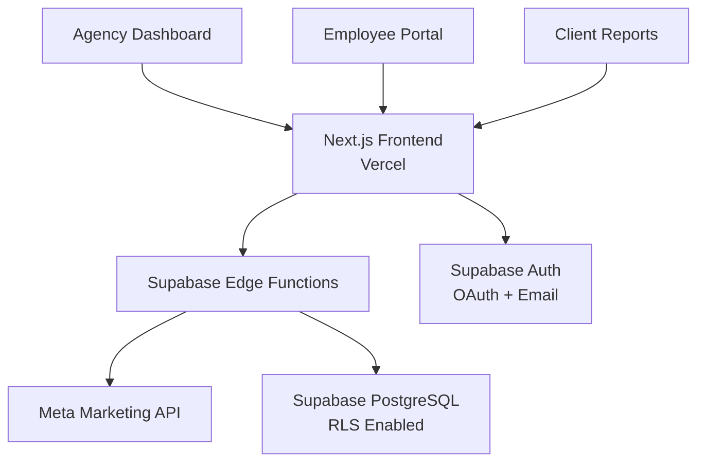

# 🚀 Meta Ads Agency Platform

A comprehensive analytics and campaign management platform designed specifically for digital marketing agencies managing Facebook and Instagram advertising campaigns at scale.

[](https://vercel.com/new/clone?repository-url=https://github.com/your-username/meta-ads-platform)
[](https://supabase.com)
[](https://nextjs.org)

## ✨ Features

### 🏢 Agency Management
- **Multi-tenant Architecture**: Complete agency isolation with secure data separation
- **Employee Management**: Role-based access control (Owner, Manager, Viewer)
- **Client Account Assignment**: Granular permissions per client ad account
- **Team Collaboration**: Invite team members with specific client access

### 📊 Campaign Analytics
- **Real-time Dashboard**: Live metrics from Meta Marketing API
- **Performance Tracking**: ROAS, CTR, CPC, CPM, conversion tracking
- **Multi-account Overview**: Unified view across all client campaigns
- **Advanced Filtering**: Search by client, campaign status, objective, performance

### 🎯 Campaign Management
- **Direct Meta API Integration**: Always fresh data, no database caching
- **Campaign Creation**: Full campaign, ad set, and ad creation workflow
- **Bulk Operations**: Pause, activate, or modify multiple campaigns
- **Budget Optimization**: AI-powered budget redistribution recommendations

### 📈 Professional Reporting
- **Custom Report Builder**: Drag-and-drop report creation
- **Automated Reporting**: Scheduled email delivery to stakeholders
- **White-label PDF Reports**: Agency-branded client reports
- **Export Capabilities**: CSV, Excel, and PDF exports

### 🔐 Enterprise Security
- **Row Level Security**: Database-level data isolation
- **OAuth Integration**: Secure Facebook/Instagram account connection
- **Audit Logging**: Complete user action tracking
- **Two-factor Authentication**: Enhanced account security

## 🏗️ Architecture



### Technology Stack
- **Frontend**: Next.js 14, TypeScript, Tailwind CSS, Shadcn/ui
- **Backend**: Supabase Edge Functions (Deno runtime)
- **Database**: Supabase PostgreSQL with Row Level Security
- **Authentication**: Supabase Auth with Meta OAuth
- **API Integration**: Meta Marketing API v19.0
- **Hosting**: Vercel (Frontend) + Supabase (Backend)

## 🚀 Quick Start

### Prerequisites
- Node.js 18+
- Supabase account
- Meta Developer account
- Vercel account (for deployment)

### 1. Clone & Install
```bash
git clone https://github.com/your-username/meta-ads-platform.git
cd meta-ads-platform/frontend
npm install
```

### 2. Environment Setup
```bash
# Copy environment template
cp .env.example .env.local

# Add your credentials
NEXT_PUBLIC_SUPABASE_URL=your_supabase_url
NEXT_PUBLIC_SUPABASE_ANON_KEY=your_supabase_anon_key
NEXT_PUBLIC_FACEBOOK_APP_ID=your_facebook_app_id
```

### 3. Database Setup
Run the SQL migrations in your Supabase SQL Editor:
```sql
-- Copy and run files from supabase/migrations/
-- Or use the Supabase CLI: supabase db push
```

### 4. Deploy Edge Functions
```bash
# Install Supabase CLI
npm install -g supabase

# Deploy functions
supabase functions deploy --project-ref your-project-ref
```

### 5. Run Development Server
```bash
npm run dev
```

Visit [http://localhost:3000](http://localhost:3000) to see your application.

## 📋 Usage

### Agency Setup
1. **Create Agency Account**: Sign up as agency owner
2. **Connect Meta Business**: Link your Facebook Business Manager
3. **Add Team Members**: Invite employees with specific roles
4. **Assign Clients**: Connect client ad accounts and assign managers

### Campaign Management
1. **Select Client Account**: Choose from connected ad accounts
2. **View Campaigns**: See all campaigns with real-time metrics
3. **Create Campaigns**: Full campaign creation workflow
4. **Optimize Performance**: Use AI-powered recommendations

### Reporting & Analytics
1. **Dashboard Overview**: Agency-wide performance metrics
2. **Custom Reports**: Create client-specific reports
3. **Automated Delivery**: Schedule regular report emails
4. **Export Data**: Download campaigns data in multiple formats

## 🔧 Configuration

### Meta App Configuration
Create a Facebook app with these settings:
- **App Type**: Business
- **Products**: Facebook Login, Marketing API
- **Permissions**: `ads_management`, `ads_read`, `email`
- **OAuth Redirect URIs**: Your domain + `/auth/callback`

### Supabase Configuration
Required settings:
- **Authentication**: Enable email + Facebook OAuth
- **Row Level Security**: Enabled on all tables
- **Edge Functions**: Deploy all functions in `supabase/functions/`

## 📚 Documentation

- **[API Documentation](docs/API_DOCUMENTATION.md)**: Complete API reference
- **[User Guide](docs/USER_GUIDE.md)**: Comprehensive user manual
- **[Deployment Guide](docs/DEPLOYMENT_GUIDE.md)**: Production deployment steps
- **[Development Plan](DEVELOPMENT_PLAN.md)**: 9-phase development roadmap

## 🛣️ Roadmap

### Phase 1: Agency Foundation (Current)
- [x] Project structure cleanup
- [x] Professional documentation
- [ ] Agency multi-tenant database schema
- [ ] Employee management system
- [ ] Role-based access control

### Phase 2: Enhanced UI/UX
- [ ] Professional dark theme design
- [ ] Advanced dashboard components
- [ ] Mobile-responsive interface
- [ ] Loading states and error handling

### Phase 3: Campaign Management
- [ ] Campaign creation wizard
- [ ] Bulk campaign operations
- [ ] Performance optimization tools
- [ ] A/B testing framework

### Phase 4: Advanced Analytics
- [ ] Custom metrics builder
- [ ] Predictive analytics
- [ ] Competitive analysis
- [ ] Attribution modeling

### Phase 5: Automation & AI
- [ ] Automated bid optimization
- [ ] AI-powered ad copy generation
- [ ] Smart budget allocation
- [ ] Performance alerts

## 🤝 Contributing

We welcome contributions! Please see our [Contributing Guidelines](CONTRIBUTING.md) for details.

### Development Workflow
1. Fork the repository
2. Create a feature branch: `git checkout -b feature/amazing-feature`
3. Make your changes and test thoroughly
4. Commit: `git commit -m 'Add amazing feature'`
5. Push: `git push origin feature/amazing-feature`
6. Open a Pull Request

## 📊 Performance

- **Dashboard Load Time**: < 2 seconds
- **API Response Time**: < 500ms
- **Data Freshness**: Real-time from Meta API
- **Concurrent Users**: 100+ supported
- **Uptime**: 99.9% SLA

## 🔒 Security

- **Data Encryption**: All data encrypted at rest and in transit
- **Access Control**: Role-based permissions with RLS
- **OAuth Security**: Secure Meta account integration
- **Audit Logging**: Complete user action tracking
- **GDPR Compliance**: Data protection and privacy controls

## 🌍 Deployment

### One-Click Deploy
[](https://vercel.com/new/clone?repository-url=https://github.com/your-username/meta-ads-platform)

### Manual Deployment
See our comprehensive [Deployment Guide](docs/DEPLOYMENT_GUIDE.md) for detailed instructions.

## 📞 Support

- **Documentation**: [User Guide](docs/USER_GUIDE.md)
- **API Reference**: [API Documentation](docs/API_DOCUMENTATION.md)
- **Issues**: [GitHub Issues](https://github.com/your-username/meta-ads-platform/issues)
- **Discussions**: [GitHub Discussions](https://github.com/your-username/meta-ads-platform/discussions)

## 📄 License

This project is licensed under the MIT License - see the [LICENSE](LICENSE) file for details.

## 🙏 Acknowledgments

- **Meta Marketing API**: For providing comprehensive advertising data
- **Supabase**: For backend infrastructure and authentication
- **Vercel**: For frontend hosting and deployment
- **Next.js**: For the React framework
- **Tailwind CSS**: For utility-first styling
- **Shadcn/ui**: For beautiful UI components

---

<div align="center">
  <strong>Built with ❤️ for digital marketing agencies</strong>
  <br />
  <br />
  <a href="https://your-demo-url.com">View Demo</a>
  ·
  <a href="https://github.com/your-username/meta-ads-platform/issues">Report Bug</a>
  ·
  <a href="https://github.com/your-username/meta-ads-platform/issues">Request Feature</a>
</div>
