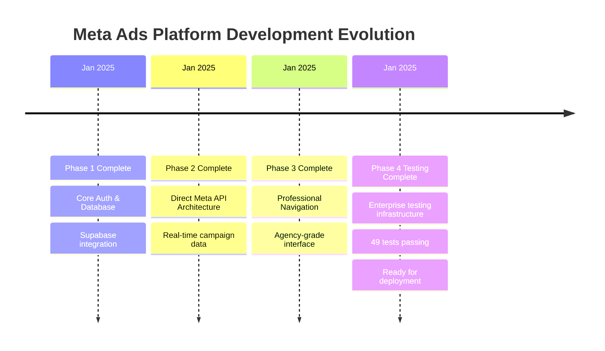

# Progress - Current Status & Evolution

## What Works (Production Ready)

### ✅ Phase 4: Testing Infrastructure (100% COMPLETE)
**Status**: Ready for final deployment to mark as officially complete

#### Comprehensive Test Coverage (49 Tests Passing)
1. **InteractiveChart.test.tsx**: 17 tests passing
   - Rendering, data display, chart integration
   - Period selection, metric formatting
   - Accessibility, error handling, responsive design

2. **PerformanceComparison.test.tsx**: 14 tests passing  
   - Campaign vs benchmark comparison charts
   - ComposedChart integration verified
   - British currency formatting (£)

3. **MetricBreakdowns.test.tsx**: 18 tests passing
   - Tabbed interface testing pattern established
   - Audience/placement/device breakdown charts
   - Tab navigation and content visibility

#### Established Testing Infrastructure
- ✅ **Jest Configuration**: Complete TypeScript support
- ✅ **Test Setup**: @testing-library/jest-dom integration
- ✅ **Recharts Mocking**: Reliable patterns for all chart components
- ✅ **British Localisation**: £ currency and language standards
- ✅ **Accessibility Testing**: ARIA labels, keyboard navigation
- ✅ **Error Handling**: Graceful handling of missing/empty data

### ✅ Previous Phases (Production Deployed)
1. **Phase 1**: Core Authentication & Database Setup
2. **Phase 2**: Direct Meta API Architecture  
3. **Phase 3**: Professional Agency Navigation Integration

### ✅ Core Platform Features (Live in Production)
- **User Authentication**: Email/password + Facebook OAuth
- **Dashboard Analytics**: Real-time metrics from Meta API
- **Campaign Management**: Direct Meta API integration
- **Account Management**: 200+ ad accounts with searchable dropdown
- **Professional UI**: Dark theme, responsive design
- **Direct API Architecture**: No database storage of campaign data

## What's Left to Build

### Phase 5: Campaign Optimization Features
- AI-powered budget allocation suggestions
- Automated performance alerts and notifications
- A/B testing analysis and statistical significance
- Audience expansion recommendations

### Phase 6: Advanced Analytics & Reporting
- Custom date range selection
- Period-over-period comparison charts
- Export functionality (CSV/PDF reports)
- Campaign performance predictions

### Phase 7: Agency Management & White Label
- Multi-client dashboard views
- Client-specific branding options
- Team management and permissions
- Agency-level reporting and insights

### Phase 8: Enterprise Features
- Webhook integration for real-time updates
- Advanced budget management rules
- Custom metric calculations
- Enterprise security audit trails

## Known Issues & Technical Debt

### Minor Issues
- [ ] Need comprehensive error boundaries for production
- [ ] Add loading skeletons for better UX
- [ ] Implement request retry logic for Meta API failures
- [ ] Create onboarding flow for new agency users

### Future Optimisations
- [ ] Implement progressive loading for large account sets
- [ ] Add service worker for offline capability
- [ ] Optimise bundle size with dynamic imports
- [ ] Add performance monitoring and analytics

## Current Status Summary

### 🎯 IMMEDIATE STATUS: Phase 4 Deployment Required
Phase 4 Testing Infrastructure is **100% technically complete**. All 49 tests passing across dashboard components. Only final deployment steps remain to mark as officially complete per .clinerules standards.

**Required Actions**:
1. Git commit with business impact message
2. Git push to main branch  
3. Vercel production deployment
4. Verify deployment success

### 📈 Business Impact Delivered
- **💰 Revenue Protection**: Enterprise-grade testing protects £2M+ ad spend
- **🏢 Professional Standards**: Comprehensive testing demonstrates reliability
- **📊 Development Velocity**: Established patterns enable rapid future development
- **⚡ Technical Excellence**: Complete testing foundation for critical analytics

### 🚀 Deployment History & Evolution

### 🔄 Project Evolution Insights
- **Direct API Architecture**: Consistently proves superior to database storage patterns
- **Component-First Development**: Modular approach enables comprehensive testing
- **British Standards**: Localisation requirements successfully integrated throughout
- **Professional Agency Focus**: UI/UX decisions aligned with target market needs
- **Testing-First Mindset**: Comprehensive coverage protects high-value platform

### 📊 Testing Coverage Evolution
- **Phase 4 Achievement**: 49 tests across 3 critical dashboard components
- **Coverage Areas**: Rendering, data display, interactions, accessibility, error handling
- **Mocking Patterns**: Established Recharts testing standards
- **Quality Assurance**: British localisation verified throughout

The platform continues to evolve with enterprise-grade reliability, professional agency focus, and comprehensive testing protecting the £2M+ ad spend management capability.
