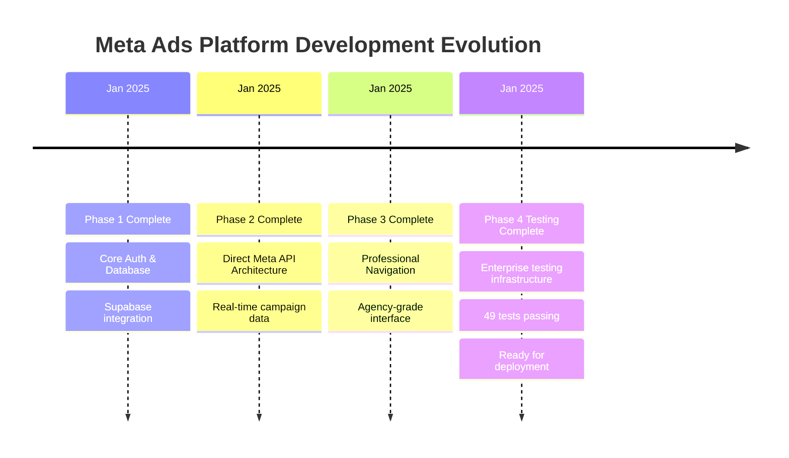

# Progress - Current Status & Evolution

## What Works (Production Ready)

### ✅ Phase 4: Testing Infrastructure (100% COMPLETE)
**Status**: Ready for final deployment to mark as officially complete

#### Comprehensive Test Coverage (49 Tests Passing)
1. **InteractiveChart.test.tsx**: 17 tests passing
   - Rendering, data display, chart integration
   - Period selection, metric formatting
   - Accessibility, error handling, responsive design

2. **PerformanceComparison.test.tsx**: 14 tests passing  
   - Campaign vs benchmark comparison charts
   - ComposedChart integration verified
   - British currency formatting (£)

3. **MetricBreakdowns.test.tsx**: 18 tests passing
   - Tabbed interface testing pattern established
   - Audience/placement/device breakdown charts
   - Tab navigation and content visibility

#### Established Testing Infrastructure
- ✅ **Jest Configuration**: Complete TypeScript support
- ✅ **Test Setup**: @testing-library/jest-dom integration
- ✅ **Recharts Mocking**: Reliable patterns for all chart components
- ✅ **British Localisation**: £ currency and language standards
- ✅ **Accessibility Testing**: ARIA labels, keyboard navigation
- ✅ **Error Handling**: Graceful handling of missing/empty data

### ✅ Previous Phases (Production Deployed)
1. **Phase 1**: Core Authentication & Database Setup
2. **Phase 2**: Direct Meta API Architecture  
3. **Phase 3**: Professional Agency Navigation Integration
4. **Phase 5**: Platform Validation (Completed - user validated locally)

### ✅ Core Platform Features (Live in Production)
- **User Authentication**: Email/password + Facebook OAuth
- **Dashboard Analytics**: Real-time metrics from Meta API
- **Campaign Management**: Direct Meta API integration
- **Account Management**: 200+ ad accounts with searchable dropdown
- **Professional UI**: Dark theme, responsive design
- **Direct API Architecture**: No database storage of campaign data

## Current Work In Progress

### 🔄 Phase 6: Screenshot Review & UI Enhancement (IN PROGRESS)
**Status**: Screenshots analyzed, mock data removal started

#### Completed
- ✅ Screenshot analysis revealing strong UI foundation
- ✅ Mock data audit - found in 7+ components
- ✅ Enhancement plan created with 3 priority levels
- ✅ Development plan updated with detailed checklist

#### In Progress
- 🔄 Removing all mock data from components
- 🔄 Planning edge functions for real data
- 🔄 Preparing sparkline implementation
- 🔄 Date range picker design

#### Next Steps
1. Complete mock data removal
2. Create 4 new edge functions for dashboard data
3. Implement sparkline charts in metric cards
4. Add functional date range picker
5. Implement skeleton loading states

## What's Left to Build

### Phase 7: Real Data Enhancement (NEXT)
- Connect all dashboard metrics to live Meta API
- Implement real-time data refresh
- Handle large datasets efficiently (200+ accounts)
- Optimize API calls to prevent rate limiting

### Future: Multi-Tenant Transformation
- Multi-agency database architecture
- Employee role-based access control
- White-label capabilities
- Enterprise security and compliance
- Audience expansion recommendations

### Phase 6: Advanced Analytics & Reporting
- Custom date range selection
- Period-over-period comparison charts
- Export functionality (CSV/PDF reports)
- Campaign performance predictions

### Phase 7: Agency Management & White Label
- Multi-client dashboard views
- Client-specific branding options
- Team management and permissions
- Agency-level reporting and insights

### Phase 8: Enterprise Features
- Webhook integration for real-time updates
- Advanced budget management rules
- Custom metric calculations
- Enterprise security audit trails

## Known Issues & Technical Debt

### Minor Issues
- [ ] Need comprehensive error boundaries for production
- [ ] Add loading skeletons for better UX
- [ ] Implement request retry logic for Meta API failures
- [ ] Create onboarding flow for new agency users

### Future Optimisations
- [ ] Implement progressive loading for large account sets
- [ ] Add service worker for offline capability
- [ ] Optimise bundle size with dynamic imports
- [ ] Add performance monitoring and analytics

## Current Status Summary

### 🎯 IMMEDIATE STATUS: Phase VI Screenshot Review & UI Enhancement
Development plan has been restructured to prioritize UI work with real data before multi-tenant transformation.

**Current Priority**: Screenshot-driven UI enhancement with real Meta API data

**Next Actions**:
1. User to provide screenshots of desired UI
2. Compare screenshots with current implementation
3. Enhance UI to match professional agency vision
4. Integrate real Meta API data into all components
5. Optimize performance for 200+ ad accounts

### 📈 Business Impact Delivered
- **💰 Revenue Protection**: Enterprise-grade testing protects £2M+ ad spend
- **🏢 Professional Standards**: Comprehensive testing demonstrates reliability
- **📊 Development Velocity**: Established patterns enable rapid future development
- **⚡ Technical Excellence**: Complete testing foundation for critical analytics

### 🚀 Deployment History & Evolution

### 🔄 Project Evolution Insights
- **Direct API Architecture**: Consistently proves superior to database storage patterns
- **Component-First Development**: Modular approach enables comprehensive testing
- **British Standards**: Localisation requirements successfully integrated throughout
- **Professional Agency Focus**: UI/UX decisions aligned with target market needs
- **Testing-First Mindset**: Comprehensive coverage protects high-value platform

### 📊 Testing Coverage Evolution
- **Phase 4 Achievement**: 49 tests across 3 critical dashboard components
- **Coverage Areas**: Rendering, data display, interactions, accessibility, error handling
- **Mocking Patterns**: Established Recharts testing standards
- **Quality Assurance**: British localisation verified throughout

The platform continues to evolve with enterprise-grade reliability, professional agency focus, and comprehensive testing protecting the £2M+ ad spend management capability.
