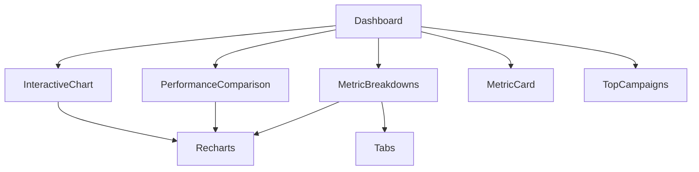
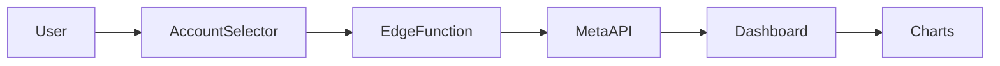

# System Patterns & Architecture

## Core Architecture Principles

### Direct Meta API Pattern (CRITICAL)
**Always fetch fresh data directly from Meta API - never cache in database**

```typescript
// ✅ CORRECT: Direct API pattern
const campaigns = await api.getCampaigns(accountId) // Fresh from Meta

// ❌ WRONG: Database storage pattern  
const campaigns = await db.campaigns.findMany() // Stale data
```

### 🚨 CRITICAL LESSON: Database Validation Anti-Pattern
**NEVER validate account access through database before Meta API calls**

```typescript
// ❌ WRONG: Database validation anti-pattern
const accountData = await supabase
  .from('meta_ad_accounts')
  .select('*')
  .eq('account_id', account_id)
  .single()

if (!accountData) {
  return new Response('Account not found', { status: 403 })
}

// ✅ CORRECT: Direct Meta API validation
const metaResponse = await fetch(`https://graph.facebook.com/v19.0/${account_id}/insights`, {
  headers: { Authorization: `Bearer ${token}` }
})

if (!metaResponse.ok) {
  return new Response('Invalid account or access denied', { status: 403 })
}
```

**Why this matters:**
- Database may not have all user's accounts
- Meta API is authoritative source of access permissions
- Reduces complexity and eliminates sync issues
- Faster response times (one API call vs database + API)

## Railway Backend Architecture (NEW)

### Live Meta API Monitoring Pattern
**Use Railway for always-on server with real-time logging**

```typescript
// ✅ NEW: Railway backend for live monitoring
Frontend (Vercel) → Railway Backend → Meta API
                 ↘ Database (Supabase) ↗

// Railway benefits:
// - Always-on server (not serverless)
// - Real-time console logs: railway logs --deployment
// - Live debugging of Meta API responses
// - Comprehensive error tracking
```

### Railway vs Supabase Edge Functions

| Feature | Railway | Supabase Edge Functions |
|---------|---------|-------------------------|
| **Live Monitoring** | ✅ `railway logs --deployment` | ❌ Limited logging |
| **Always-On Server** | ✅ Persistent process | ❌ Serverless (spin up/down) |
| **Real-time Debugging** | ✅ Live console output | ❌ Function invocation logs only |
| **Development Experience** | ✅ Like `vercel logs --follow` | ❌ No live streaming |
| **Meta API Debugging** | ✅ See exact API responses | ❌ Limited visibility |

### Railway Deployment Pattern

```bash
# Setup Railway project
cd backend/
railway login
railway init
railway variables --set "SUPABASE_URL=..."
railway variables --set "SUPABASE_SERVICE_ROLE_KEY=..."
railway up

# Live monitoring
railway logs --deployment  # Real-time Meta API call tracking
```

### Railway App Structure
```python
# app.py - Railway FastAPI backend
@app.post("/api/dashboard-metrics")
async def get_dashboard_metrics(request_data, meta_token: str = Depends(get_user_meta_token)):
    logger.info(f"🔄 [DASHBOARD] Starting metrics fetch for account: {account_id}")
    logger.info(f"🌐 [META API] Calling insights endpoint: {insights_url}")
    logger.info(f"📊 [META API] Raw insights response: {insights_data}")
    logger.info(f"✅ [SUCCESS] Dashboard metrics processed successfully")
    # Real-time visibility into Meta API responses!
```

### Component Architecture

#### Dashboard Components Structure
```
components/dashboard/
├── InteractiveChart.tsx        # Multi-chart dashboard with period selection
├── PerformanceComparison.tsx   # Campaign vs benchmark charts  
├── MetricBreakdowns.tsx        # Tabbed audience/placement/device breakdowns
├── MetricCard.tsx              # Key metric display cards
├── TopCampaigns.tsx            # Campaign performance ranking
└── __tests__/                  # Comprehensive test coverage
    ├── InteractiveChart.test.tsx      # 17 tests passing
    ├── PerformanceComparison.test.tsx # 14 tests passing
    └── MetricBreakdowns.test.tsx      # 18 tests passing
```

#### Named Export Pattern (Established)
```typescript
// All dashboard components use named exports
export function ComponentName() { ... }

// Import pattern
import { ComponentName } from '../ComponentName'
```

### Data Flow Architecture

#### User Authentication Flow
```
User Login → Supabase Auth → Facebook OAuth → Meta API Token → Profile Storage
```

#### Campaign Data Flow
```
Frontend → Edge Function → Meta API → Real-time Response
```

#### Account Management Flow
```
User → Account Selector → meta-accounts-v3 → Meta API → Account List
```

## Key Technical Decisions

### Database Usage (STRICT RULES)
**✅ Store in Database:**
- User profiles (auth.users, profiles)
- Meta ad account references (ID, name, status only)
- User preferences and settings

**❌ NEVER Store in Database:**
- Campaign data (fetch from Meta API)
- Campaign metrics (fetch from Meta API) 
- Ad performance data (fetch from Meta API)
- Any data available from Meta API

### Testing Patterns

#### Recharts Mocking (Established Standard)
```typescript
jest.mock('recharts', () => ({
  ResponsiveContainer: ({ children }: any) => <div data-testid="responsive-container">{children}</div>,
  PieChart: ({ children }: any) => <div data-testid="pie-chart">{children}</div>,
  BarChart: ({ children }: any) => <div data-testid="bar-chart">{children}</div>,
  ComposedChart: ({ children }: any) => <div data-testid="composed-chart">{children}</div>,
  Tooltip: () => <div data-testid="tooltip" />,
  Legend: () => <div data-testid="legend" />,
  // ... consistent pattern for all chart components
}))
```

#### Test Structure Pattern
```typescript
describe('ComponentName', () => {
  // Mock data setup
  const mockData = { ... }
  
  // Rendering tests
  it('renders without crashing', () => { ... })
  it('displays key elements', () => { ... })
  
  // Data display tests  
  it('shows correct metrics', () => { ... })
  it('formats currency as British pounds', () => { ... })
  
  // Interaction tests
  it('handles user interactions', () => { ... })
  
  // Chart integration tests
  it('renders chart components', () => { ... })
  
  // Accessibility tests
  it('has proper ARIA labels', () => { ... })
  
  // Error handling tests
  it('handles missing data gracefully', () => { ... })
})
```

### API Integration Patterns

#### Supabase Edge Functions
```typescript
// Standard edge function pattern
export default async function handler(req: Request) {
  try {
    // Validate request
    // Extract user context
    // Call Meta API
    // Return standardised response
  } catch (error) {
    // Structured error handling
  }
}
```

#### Meta API Client Pattern
```typescript
// Direct API calls with proper error handling
const response = await fetch(`https://graph.facebook.com/v19.0/${endpoint}`, {
  headers: { Authorization: `Bearer ${accessToken}` }
})
```

## Component Relationships

### Dashboard Component Dependencies


### Data Flow Dependencies


## Critical Implementation Paths

### Campaign Loading Flow
1. User selects account from dropdown
2. get-campaigns-from-meta edge function triggered
3. Direct Meta API call with user's access token
4. Campaign data returned and displayed
5. No database storage of campaign data

### Authentication Flow
1. User signs up/logs in via Supabase Auth
2. Facebook OAuth initiated for Meta access
3. provider_token captured and stored in profiles.meta_access_token
4. Token used for all subsequent Meta API calls

### Testing Flow
1. Jest configuration with TypeScript support
2. setupTests.ts with @testing-library/jest-dom
3. Recharts mocking for chart components
4. British localisation verification
5. Comprehensive coverage: rendering, data, interaction, accessibility, error handling
